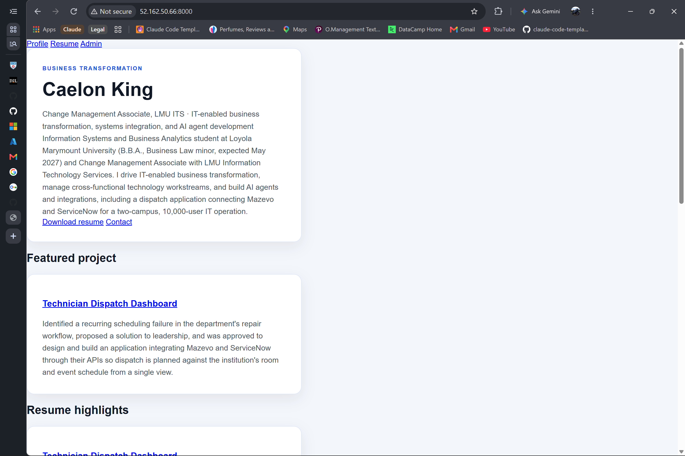

# Exercise 3 evidence: career-platform on an Azure VM

## VM details

| Setting | Value |
|---|---|
| VM name | `vm-career-platform` |
| Resource group | `rg-career-platform` |
| Region | North Central US (`northcentralus`) |
| Size | `Standard_B2ats_v2` (2 vCPU, 1 GiB RAM) |
| Image | Ubuntu Server 24.04 LTS, x64 Gen2 |
| OS disk | Standard SSD, deleted with the VM |
| NIC and public IP | Deleted with the VM; public IP is static |
| Authentication | SSH public key only, user `azureuser`; password login disabled |
| Inbound rules | SSH (22) from the operator laptop's `/32` only. For the screenshot, a temporary rule allowed TCP 8000 from the same `/32`, then was removed |
| Auto-shutdown | 18:00 Pacific daily, with a 30-minute email warning |
| Boot diagnostics | Off |
| Tags | `course=isba-4775`, `environment=staging` |
| Cost guard | $15/month budget with email alerts at 50%, 100%, and 100% forecast |
| App | FastAPI + Uvicorn from `~/career-platform`, dependencies from `uv.lock` via `uv sync --locked`, SQLite at the Alembic head revision |

The deployment steps and their results are in
[`docs/superpowers/plans/2026-09-24-azure-vm-migration.md`](../superpowers/plans/2026-09-24-azure-vm-migration.md).

## Screenshot

My site served from the VM's public IP on port 8000:

## What broke

1. **The course region was blocked.** The Azure for Students subscription has an "Allowed resource deployment regions" policy that only permits `northcentralus`, `canadacentral`, `denmarkeast`, `belgiumcentral`, and `norwayeast`. West US 2 was denied, so the VM runs in North Central US.
2. **The course VM size was blocked.** `Standard_B2ts_v2` and almost every B-series size returned `NotAvailableForSubscription`, and the cheapest sizes (B1ls, B1s) weren't offered at all. `Standard_B2ats_v2` was the cheapest x64 size available, and it has the same 2 vCPU / 1 GiB.
3. **The public IP wouldn't delete with the VM.** `az vm create` makes the NIC as its own resource, and the public IP's delete option couldn't be set afterward. The VM was recreated from an ARM template that sets `deleteOption: Delete` on the OS disk, NIC, and public IP at creation.
4. **Auto-shutdown failed twice.** `az vm auto-shutdown` put the schedule in the resource group's region (West US 2, blocked by policy), and the subscription wasn't registered for `Microsoft.DevTestLab`. Fixed by registering the provider and creating the schedule directly in `northcentralus` with the `Pacific Standard Time` time zone instead of the CLI's UTC default.
5. **Git Bash rewrote Azure resource IDs.** Arguments starting with `/subscriptions/...` were turned into Windows paths. Fixed with `MSYS_NO_PATHCONV=1`.
6. **There was no lock file.** The plan called for `uv sync` from a lock file, but the repo had no `uv.lock`. It was generated on the laptop, committed, and pushed, then installed on the VM with `uv sync --locked`.
7. **The database to migrate was empty.** The laptop's `career_platform.db` had no tables; it turned out to be a byproduct of running the test suite. The schema was created on the VM with `alembic upgrade head`, and my resume content was loaded in one transaction. `career_platform.db` is now git-ignored.
8. **The public snapshot showed a demo profile.** The committed fallback pages were for a demo profile ("Alex Jordan"). They were regenerated from the VM's database and committed with my name and projects, but no email or phone.
9. **The SSH tunnel outlived its task.** Stopping the background task left `ssh.exe` holding local port 8000, so that exact process was ended.

## The change

The command would hang in the coffee shop because it is not going to be the same public IP you limited access to in the inbound port settings of the VM. I would go into the network configuration/settings of the VM, add a new port rule allowing access from the coffee shop temporarily so that I can access it in the moment but not grant permanenet acess so that the VM cannot be accessed from the coffee shop incase of security issues. This would not cost anything.
